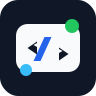

# tokenjuice 🧃

lean output compaction for terminal-heavy agent workflows.

## what is tokenjuice?

tokenjuice is a deterministic output compactor for terminal-heavy agent workflows. agents and harnesses run noisy commands like `git status`, `pnpm test`, `docker build`, `rg`, or `pnpm --help`; tokenjuice keeps the command semantics untouched, observes the output after execution, and returns a smaller payload built from rule-driven reducers instead of dumping the whole wall of terminal text back into context.

the point is leverage: less transcript waste, fewer useless reruns, and cleaner handoff between tools without making the shell magical. raw output stays available only when you explicitly ask for it through `--raw` / `--full` or opt-in artifact storage, rules stay inspectable JSON instead of LLM vibes, and host integrations stay thin wrappers around the same core reducer instead of becoming one-off adapter logic.

## host integrations

supported integrations:

| Logo | Client | Install | Hook file |
| --- | --- | --- | --- |
|  | [Claude Code](https://docs.anthropic.com/en/docs/claude-code) | `tokenjuice install claude-code` | `~/.claude/settings.json` |
|  | [CodeBuddy](https://codebuddy.tencent.com/) | `tokenjuice install codebuddy` | `~/.codebuddy/settings.json` |
|  | [Codex CLI](https://github.com/openai/codex) | `tokenjuice install codex` | `~/.codex/hooks.json` |
|  | [Cursor](https://cursor.com/docs/hooks) | `tokenjuice install cursor` | `~/.cursor/hooks.json` |
|  | [Droid (Factory CLI)](https://docs.factory.ai/cli/configuration/hooks-guide) | `tokenjuice install droid` | `~/.factory/settings.json` |
|  | [GitHub Copilot CLI](https://github.com/github/copilot-cli) | `tokenjuice install copilot-cli` | `~/.copilot/hooks/tokenjuice-cli.json` |
|  | [OpenClaw](https://openclaw.ai/) | `openclaw config set plugins.entries.tokenjuice.enabled true` | `~/.openclaw/openclaw.json` |
|  | [OpenCode](https://opencode.ai/) | `tokenjuice install opencode` | `~/.config/opencode/plugins/tokenjuice.js` |
|  | [pi](https://github.com/badlogic/pi-mono/tree/main/packages/coding-agent) | `tokenjuice install pi` | `~/.pi/agent/extensions/tokenjuice.js` |
|  | [VS Code Copilot Chat](https://code.visualstudio.com/docs/copilot/overview) | `tokenjuice install vscode-copilot` | `~/.copilot/hooks/tokenjuice-vscode.json` |

beta integrations:

| Logo | Client | Install | Hook file |
| --- | --- | --- | --- |
|  | [AdaL CLI](https://docs.sylph.ai/features/plugins-and-skills) | `tokenjuice install adal` | `AGENTS.md` |
|  | [Aether](https://aether-agent.io/) | `tokenjuice install aether` | `.aether/tokenjuice.md` / `.aether/settings.json` |
|  | [aictl](https://www.aictl.app/) | `tokenjuice install aictl` | `AICTL.md` |
|  | [AI Memory Protocol](https://github.com/bburda/ai_memory_protocol) | `tokenjuice install ai-memory-protocol` | `.memories/memory/preferences.rst` |
|  | [Aider](https://aider.chat/) | `tokenjuice install aider` | `CONVENTIONS.tokenjuice.md` |
|  | [Agent Layer](https://agent-layer.dev/docs/) | `tokenjuice install agent-layer` | `.agent-layer/instructions/tokenjuice.md`; run `al sync` after install or uninstall |
|  | [AgentInit](https://pypi.org/project/agentinit/) | `tokenjuice install agentinit` | `AGENTS.md`; run `agentinit sync` after install or uninstall |
|  | [Agentlink](https://agentlink.run/) | `tokenjuice install agentlink` | `AGENTS.md`; run `agentlink sync` after install or uninstall |
|  | [Agentloom](https://agentloom.sh/docs) | `tokenjuice install agentloom` | `.agents/rules/tokenjuice-agentloom.md`; run `agentloom sync` after install or uninstall |
|  | [agents-cli](https://agents-cli.sh/) | `tokenjuice install agents-cli` | `~/.agents/memory/AGENTS.md`; run `agents sync` after install or uninstall |
|  | [AGENTS.md](https://agents.md/) | `tokenjuice install agents-md` | `AGENTS.md` |
|  | [agents.ge](https://agents.ge/) | `tokenjuice install agentsge` | `.agents/rules/tokenjuice-agentsge.md` |
|  | [AgentsMesh](https://samplexbro.github.io/agentsmesh/) | `tokenjuice install agentsmesh` | `.agentsmesh/rules/tokenjuice.md`; run `agentsmesh generate` after install or uninstall |
|  | [Amazon Q Developer CLI / Kiro compatibility](https://kiro.dev/docs/cli/migrating-from-q/) | `tokenjuice install amazon-q` | `.amazonq/rules/tokenjuice.md` |
|  | [Amp](https://ampcode.com/manual) | `tokenjuice install amp` | `AGENTS.md` / `AGENT.md` / `CLAUDE.md` |
|  | [Google Antigravity](https://antigravity.google/) | `tokenjuice install antigravity` | `.agents/rules/tokenjuice.md` |
|  | [anywhere-agents](https://anywhere-agents.readthedocs.io/) | `tokenjuice install anywhere-agents` | `AGENTS.local.md`; run `anywhere-agents` after install or uninstall |
|  | [Augment](https://docs.augmentcode.com/cli/rules) | `tokenjuice install augment` | `.augment/rules/tokenjuice.md` |
|  | [Avante.nvim](https://github.com/yetone/avante.nvim) | `tokenjuice install avante` | `avante.md` |
|  | [Baz](https://docs.baz.co/agents/skills-and-instructions) | `tokenjuice install baz` | `.baz/skills/tokenjuice/SKILL.md` |
|  | [Bito](https://docs.bito.ai/ai-code-reviews-in-git/agent-settings/repo-level-settings) | `tokenjuice install bito` | `.bito.yaml` / `.bito/tokenjuice.md` |
|  | [IBM Bob Shell](https://bob.ibm.com/docs/shell/configuration/configuring) | `tokenjuice install bob` | `AGENTS.md` |
|  | [Builder](https://www.builder.io/c/docs/projects-configuration-files) | `tokenjuice install builder` | `.builder/rules/tokenjuice.mdc` |
|  | [Charlie](https://docs.charlielabs.ai/customization/instructions) | `tokenjuice install charlie` | `AGENTS.md` |
|  | [Cline](https://docs.cline.bot/features/hooks/hook-reference) | `tokenjuice install cline` | `~/Documents/Cline/Hooks/tokenjuice-post-tool-use` |
|  | [CodeAnt](https://docs.codeant.ai/ide/review/code_review_instructions) | `tokenjuice install codeant` | `.codeant/instructions.json` |
|  | [Codebuff](https://www.codebuff.com/docs/help/quick-start) | `tokenjuice install codebuff` | `AGENTS.md` |
|  | [Codegen](https://docs.codegen.com/settings/repo-rules) | `tokenjuice install codegen` | `AGENTS.md` |
|  | [Coder Agents](https://coder.com/docs/ai-coder/agents) | `tokenjuice install coder-agents` | `.agents/skills/tokenjuice/SKILL.md` |
|  | [CodeRabbit](https://docs.coderabbit.ai/configuration/path-instructions) | `tokenjuice install coderabbit` | `.coderabbit.yaml` |
|  | [Command Code](https://commandcode.ai/docs/) | `tokenjuice install command-code` | `~/.commandcode/settings.json` / `.commandcode/settings.json` |
|  | [Continue](https://docs.continue.dev/) | `tokenjuice install continue` | `.continue/rules/tokenjuice.md` |
|  | [Crush](https://github.com/charmbracelet/crush) | `tokenjuice install crush` | `.crush/skills/tokenjuice/SKILL.md` |
|  | [Deep Agents Code](https://docs.langchain.com/oss/javascript/deepagents/code/overview) | `tokenjuice install deepagents` | `.deepagents/AGENTS.md` |
|  | [Devin for Terminal](https://cli.devin.ai/docs/extensibility/hooks/overview) | `tokenjuice install devin` | `.devin/hooks.v1.json` |
|  | [dot-agents](https://www.dot-agents.com/) | `tokenjuice install dot-agents` | `~/.agents/rules/global/rules.mdc`; run `dot-agents sync` after install or uninstall |
|  | [Docker Agent](https://docs.docker.com/ai/docker-agent/) | `tokenjuice install docker-agent` | `.docker-agent/tokenjuice.md` |
|  | [ECA](https://eca.dev/) | `tokenjuice install eca` | `.eca/skills/tokenjuice/SKILL.md` |
|  | [Elyra](https://elyracode.com/) | `tokenjuice install elyra` | `.elyra/skills/tokenjuice/SKILL.md` |
|  | [Firebase Studio](https://firebase.google.com/docs/studio/set-up-gemini) | `tokenjuice install firebase-studio` | `.idx/airules.md` |
|  | [ForgeCode](https://forgecode.dev/docs/custom-rules/) | `tokenjuice install forgecode` | `AGENTS.md` |
|  | [Gemini CLI](https://github.com/google-gemini/gemini-cli) | `tokenjuice install gemini-cli` | `~/.gemini/settings.json` |
|  | [GitLab Duo Agent Platform](https://docs.gitlab.com/user/duo_agent_platform/customize/custom_rules/) | `tokenjuice install gitlab-duo` | `.gitlab/duo/chat-rules.md` |
|  | [Goose](https://goose-docs.ai/) | `tokenjuice install goose` | `.goosehints` |
|  | [Greptile](https://www.greptile.com/docs/code-review/greptile-config) | `tokenjuice install greptile` | `.greptile/rules.md` |
|  | [Grok Build](https://docs.x.ai/build/overview) | `tokenjuice install grok-build` | `AGENTS.md` |
|  | [Grok CLI](https://github.com/superagent-ai/grok-cli) | `tokenjuice install grok-cli` | `~/.grok/user-settings.json` |
|  | [gptme](https://gptme.org/docs/prompts.html) | `tokenjuice install gptme` | `AGENTS.md` |
|  | [GitHub Copilot coding agent](https://docs.github.com/en/copilot/using-github-copilot/coding-agent) | `tokenjuice install copilot-agent` | `.github/hooks/tokenjuice-agent.json` |
|  | [Jean2](https://jean2.ai/docs/deep-dive/agents-md) | `tokenjuice install jean2` | `AGENTS.md` |
|  | [JetBrains AI Assistant](https://www.jetbrains.com/help/ai-assistant/) | `tokenjuice install jetbrains-ai` | `.aiassistant/rules/tokenjuice.md` |
|  | [Junie](https://junie.jetbrains.com/docs/junie-cli-usage.html) | `tokenjuice install junie` | `.junie/AGENTS.md` |
|  | [Jules](https://jules.google/docs/) | `tokenjuice install jules` | `AGENTS.md` |
|  | [LeanCTL](https://leanctl.com/docs/configuration) | `tokenjuice install leanctl` | `.leanctl/instructions.md` |
|  | [Kimi Code CLI](https://moonshotai.github.io/kimi-cli/en/) | `tokenjuice install kimi` | `~/.kimi/config.toml` |
|  | [Kiro](https://kiro.dev/) | `tokenjuice install kiro` | `.kiro/steering/tokenjuice.md` |
|  | [Kilo Code](https://kilocode.ai/) | `tokenjuice install kilo` | `kilo.jsonc` or `.kilo/kilo.jsonc` + `.kilo/rules/tokenjuice.md` |
|  | [LocalCode](https://www.localcode.codes/) | `tokenjuice install localcode` | `~/.localcode/plugins/tokenjuice/` |
|  | [mcp-agent](https://docs.mcp-agent.com/) | `tokenjuice install mcp-agent` | `.mcp-agent/agents/tokenjuice.md` |
|  | [mini-SWE-agent](https://mini-swe-agent.com/) | `tokenjuice install mini-swe-agent` | `.mini-swe-agent/tokenjuice.yaml` |
|  | [SWE-agent](https://swe-agent.com/latest/) | `tokenjuice install swe-agent` | `.swe-agent/tokenjuice.yaml` |
|  | [Mistral Vibe](https://docs.mistral.ai/mistral-vibe/agents-skills) | `tokenjuice install mistral-vibe` | `AGENTS.md` |
|  | [Mux](https://mux.coder.com/hooks/tools) | `tokenjuice install mux` | `.mux/tool_post` |
|  | [NovaKit CLI](https://www.novakit.ai/docs/cli) | `tokenjuice install novakit` | `NOVAKIT.md` |
|  | [Knowns](https://knowns.sh/) | `tokenjuice install knowns` | `KNOWNS.md` |
|  | [Ona Agent](https://ona.com/docs/ona/agents/overview) | `tokenjuice install ona` | `AGENTS.md` |
|  | [OpenHands](https://docs.openhands.dev/) | `tokenjuice install openhands` | `.openhands/hooks.json` |
|  | [Open Interpreter](https://www.openinterpreter.com/docs/terminal/agents_md) | `tokenjuice install open-interpreter` | `AGENTS.md` |
|  | [Open WebUI](https://openwebui.com/) | `tokenjuice install openwebui` | `.openwebui/tools/tokenjuice_compact.py` |
|  | [pi-go](https://pi-go.sh/) | `tokenjuice install pi-go` | `.pi/skills/tokenjuice/SKILL.md` |
|  | [Plandex](https://docs.plandex.ai/) | `tokenjuice install plandex` | `PLANDEX.tokenjuice.md` |
|  | [Qodo Code Review](https://docs.qodo.ai/code-review/get-started/configuration-overview/configuration-file) | `tokenjuice install qodo` | `.pr_agent.toml` |
|  | [Qoder CLI](https://docs.qoder.com/cli/using-cli) | `tokenjuice install qoder` | `AGENTS.md` |
|  | [Qwen Code](https://qwenlm.github.io/qwen-code-docs/) | `tokenjuice install qwen-code` | `.qwen/settings.json` |
|  | [Replit Agent](https://docs.replit.com/references/project-setup/replit-dot-md) | `tokenjuice install replit` | `replit.md` |
|  | [Roo Code](https://roocode.com/) | `tokenjuice install roo` | `.roo/rules/tokenjuice.md` |
|  | [Rovo Dev CLI](https://support.atlassian.com/rovo/docs/use-memory-in-rovo-dev-cli/) | `tokenjuice install rovo` | `AGENTS.md` |
|  | [Ruler](https://github.com/intellectronica/ruler) | `tokenjuice install ruler` | `.ruler/tokenjuice.md` |
|  | [Tabby](https://tabby.tabbyml.com/) | `tokenjuice install tabby` | `~/.tabby/config.toml` |
|  | [Tabnine CLI](https://docs.tabnine.com/main/getting-started/tabnine-cli/features/cli-commands) | `tokenjuice install tabnine` | `TABNINE.md` |
|  | [Trae](https://traeide.com/) | `tokenjuice install trae` | `.trae/rules/project_rules.md` |
|  | [UiPath for Coding Agents](https://www.uipath.com/developers/coding-agents) | `tokenjuice install uipath` | `AGENTS.md` |
|  | [Warp](https://docs.warp.dev/agent-platform/capabilities/rules) | `tokenjuice install warp` | `AGENTS.md` / `WARP.md` |
|  | [Windsurf](https://windsurf.com/) | `tokenjuice install windsurf` | `.windsurf/rules/tokenjuice.md` |
|  | [Zed](https://zed.dev/docs/ai/rules.html) | `tokenjuice install zed` | `.rules` |
|  | [Zencoder](https://docs.zencoder.ai/rules-context/zen-rules) | `tokenjuice install zencoder` | `.zencoder/rules/tokenjuice.md` |

## install

```bash
npm install -g tokenjuice
# or
pnpm add -g tokenjuice
# or
yarn global add tokenjuice
# or
brew tap vincentkoc/tap
brew install tokenjuice
```

then:

```bash
tokenjuice --help
tokenjuice --version
tokenjuice install [adal|aether|aictl|ai-memory-protocol|aider|agent-layer|agentinit|agentlink|agentloom|agents-cli|agents-md|agentsge|agentsmesh|amazon-q|amp|antigravity|anywhere-agents|augment|avante|baz|bito|bob|builder|charlie|codex|claude-code|cline|codeant|codebuff|codegen|coder-agents|coderabbit|codebuddy|command-code|continue|copilot-agent|crush|cursor|deepagents|devin|dot-agents|docker-agent|droid|eca|elyra|firebase-studio|forgecode|gemini-cli|gitlab-duo|goose|greptile|grok-build|grok-cli|gptme|jean2|jetbrains-ai|junie|jules|leanctl|kimi|kiro|kilo|localcode|mcp-agent|mini-swe-agent|swe-agent|mistral-vibe|mux|novakit|knowns|ona|openhands|open-interpreter|openwebui|pi|pi-go|opencode|plandex|qodo|qoder|qwen-code|replit|roo|rovo|ruler|tabby|tabnine|trae|uipath|vscode-copilot|warp|windsurf|copilot-cli|zed|zencoder]
tokenjuice uninstall [adal|aether|aictl|ai-memory-protocol|aider|agent-layer|agentinit|agentlink|agentloom|agents-cli|agents-md|agentsge|agentsmesh|amazon-q|amp|antigravity|anywhere-agents|augment|avante|baz|bito|bob|builder|charlie|codex|cline|codeant|codebuff|codegen|coder-agents|coderabbit|command-code|continue|copilot-agent|crush|deepagents|devin|dot-agents|docker-agent|droid|eca|elyra|firebase-studio|forgecode|gemini-cli|gitlab-duo|goose|greptile|grok-build|grok-cli|gptme|jean2|jetbrains-ai|junie|jules|leanctl|kimi|kiro|kilo|localcode|mcp-agent|mini-swe-agent|swe-agent|mistral-vibe|mux|novakit|knowns|ona|openhands|open-interpreter|openwebui|pi-go|opencode|plandex|qodo|qoder|qwen-code|replit|roo|rovo|ruler|tabby|tabnine|trae|uipath|vscode-copilot|warp|windsurf|copilot-cli|zed|zencoder]
```

OpenClaw support is bundled on the OpenClaw side. Do not run
`tokenjuice install openclaw`; enable the bundled plugin instead:

```bash
openclaw config set plugins.entries.tokenjuice.enabled true
```

this requires OpenClaw `2026.4.22` or newer.

## commands

```bash
tokenjuice --help
tokenjuice --version
tokenjuice reduce [file]
tokenjuice reduce-json [file]
tokenjuice wrap -- <command> [args...]
tokenjuice wrap --raw -- <command> [args...]
tokenjuice wrap --store -- <command> [args...]
tokenjuice install [adal|aether|aictl|ai-memory-protocol|aider|agent-layer|agentinit|agentlink|agentloom|agents-cli|agents-md|agentsge|agentsmesh|amazon-q|amp|antigravity|anywhere-agents|augment|avante|baz|bito|bob|builder|charlie|codex|claude-code|cline|codeant|codebuff|codegen|coder-agents|coderabbit|codebuddy|command-code|continue|copilot-agent|crush|cursor|deepagents|devin|dot-agents|docker-agent|droid|eca|elyra|firebase-studio|forgecode|gemini-cli|gitlab-duo|goose|greptile|grok-build|grok-cli|gptme|jean2|jetbrains-ai|junie|jules|leanctl|kimi|kiro|kilo|localcode|mcp-agent|mini-swe-agent|swe-agent|mistral-vibe|mux|novakit|knowns|ona|openhands|open-interpreter|openwebui|pi|pi-go|opencode|plandex|qodo|qoder|qwen-code|replit|roo|rovo|ruler|tabby|tabnine|trae|uipath|vscode-copilot|warp|windsurf|copilot-cli|zed|zencoder]
tokenjuice install [adal|aether|aictl|ai-memory-protocol|aider|agent-layer|agentinit|agentlink|agentloom|agents-cli|agents-md|agentsge|agentsmesh|amazon-q|amp|antigravity|anywhere-agents|augment|avante|baz|bito|bob|builder|charlie|codex|claude-code|cline|codeant|codebuff|codegen|coder-agents|coderabbit|codebuddy|command-code|continue|copilot-agent|crush|cursor|deepagents|devin|dot-agents|docker-agent|droid|eca|elyra|firebase-studio|forgecode|gemini-cli|gitlab-duo|goose|greptile|grok-build|grok-cli|gptme|jean2|jetbrains-ai|junie|jules|leanctl|kimi|kiro|kilo|localcode|mcp-agent|mini-swe-agent|swe-agent|mistral-vibe|mux|novakit|knowns|ona|openhands|open-interpreter|openwebui|pi|pi-go|opencode|plandex|qodo|qoder|qwen-code|replit|roo|rovo|ruler|tabby|tabnine|trae|uipath|vscode-copilot|warp|windsurf|copilot-cli|zed|zencoder] --local
tokenjuice uninstall [adal|aether|aictl|ai-memory-protocol|aider|agent-layer|agentinit|agentlink|agentloom|agents-cli|agents-md|agentsge|agentsmesh|amazon-q|amp|antigravity|anywhere-agents|augment|avante|baz|bito|bob|builder|charlie|codex|cline|codeant|codebuff|codegen|coder-agents|coderabbit|command-code|continue|copilot-agent|crush|deepagents|devin|dot-agents|docker-agent|droid|eca|elyra|firebase-studio|forgecode|gemini-cli|gitlab-duo|goose|greptile|grok-build|grok-cli|gptme|jean2|jetbrains-ai|junie|jules|leanctl|kimi|kiro|kilo|localcode|mcp-agent|mini-swe-agent|swe-agent|mistral-vibe|mux|novakit|knowns|ona|openhands|open-interpreter|openwebui|pi-go|opencode|plandex|qodo|qoder|qwen-code|replit|roo|rovo|ruler|tabby|tabnine|trae|uipath|vscode-copilot|warp|windsurf|copilot-cli|zed|zencoder]
tokenjuice ls
tokenjuice cat <artifact-id>
tokenjuice verify
tokenjuice discover
tokenjuice doctor
tokenjuice doctor hooks
tokenjuice doctor pi
tokenjuice doctor opencode
tokenjuice stats
tokenjuice stats --timezone utc
```

## overview

tokenjuice has three surfaces. `reduce` compacts text that already exists, `wrap` runs a command and compacts the observed output, and `reduce-json` gives host adapters a stable machine protocol. host integrations are intentionally thin: they install a hook, extension, rule, or guidance file; call the shared compactor; and return compacted context through the host's native surface. use `tokenjuice doctor hooks` to check installed wiring, `tokenjuice doctor <host>` for one integration, and `tokenjuice install <host> --local` when validating the current repo build before release.

the reduction engine is rule-driven. built-in JSON rules live in `src/rules`, user overrides live in `~/.config/tokenjuice/rules`, and project overrides live in `.tokenjuice/rules`; later layers override earlier ones by rule id. rules classify command output, normalize lines, keep or drop patterns, count facts, and retain deterministic head/tail slices. host adapters also apply a narrow safe-inventory policy: exact file-content reads stay raw, standalone repository inventory commands can compact, and unsafe mixed command sequences stay raw.

when a reducer gets it wrong or the task needs untouched bytes, use the explicit bypass:

```bash
tokenjuice wrap --raw -- pnpm --help
tokenjuice wrap --full -- git status
```

useful maintenance commands:

```bash
tokenjuice verify --fixtures
tokenjuice discover
tokenjuice doctor hooks
tokenjuice stats --timezone utc
```

## adapter JSON

`reduce-json` is the machine-facing adapter command. it reads JSON from stdin or a file and always writes JSON to stdout; see the [spec](docs/spec.md) for envelope options and adapter behavior.

direct payload:

```json
{
  "toolName": "exec",
  "command": "pnpm test",
  "argv": ["pnpm", "test"],
  "combinedText": "RUN  v3.2.4 /repo\n...",
  "exitCode": 1
}
```

## docs

- [spec](docs/spec.md)
- [rules](docs/rules.md)
- [integration playbook](docs/integration-playbook.md)
- [AdaL CLI integration](docs/adal-integration.md)
- [Aether integration](docs/aether-integration.md)
- [Agent Layer integration](docs/agent-layer-integration.md)
- [AgentInit integration](docs/agentinit-integration.md)
- [Agentlink integration](docs/agentlink-integration.md)
- [Agentloom integration](docs/agentloom-integration.md)
- [agents-cli integration](docs/agents-cli-integration.md)
- [AGENTS.md integration](docs/agents-md-integration.md)
- [agents.ge integration](docs/agentsge-integration.md)
- [AgentsMesh integration](docs/agentsmesh-integration.md)
- [Amp integration](docs/amp-integration.md)
- [Amazon Q integration](docs/amazon-q-integration.md)
- [aictl integration](docs/aictl-integration.md)
- [AI Memory Protocol integration](docs/ai-memory-protocol-integration.md)
- [Antigravity integration](docs/antigravity-integration.md)
- [anywhere-agents integration](docs/anywhere-agents-integration.md)
- [Augment integration](docs/augment-integration.md)
- [Baz integration](docs/baz-integration.md)
- [Bito integration](docs/bito-integration.md)
- [IBM Bob integration](docs/bob-integration.md)
- [Builder integration](docs/builder-integration.md)
- [Charlie integration](docs/charlie-integration.md)
- [GitHub Copilot coding agent integration](docs/copilot-agent-integration.md)
- [CodeAnt integration](docs/codeant-integration.md)
- [Codebuff integration](docs/codebuff-integration.md)
- [Codegen integration](docs/codegen-integration.md)
- [Coder Agents integration](docs/coder-agents-integration.md)
- [CodeRabbit integration](docs/coderabbit-integration.md)
- [Command Code integration](docs/command-code-integration.md)
- [Crush integration](docs/crush-integration.md)
- [Cursor integration](docs/cursor-integration.md)
- [CodeBuddy integration](docs/codebuddy-integration.md)
- [Deep Agents Code integration](docs/deepagents-integration.md)
- [Devin integration](docs/devin-integration.md)
- [dot-agents integration](docs/dot-agents-integration.md)
- [Docker Agent integration](docs/docker-agent-integration.md)
- [ECA integration](docs/eca-integration.md)
- [Elyra integration](docs/elyra-integration.md)
- [ForgeCode integration](docs/forgecode-integration.md)
- [Goose integration](docs/goose-integration.md)
- [Greptile integration](docs/greptile-integration.md)
- [Grok Build integration](docs/grok-build-integration.md)
- [Grok CLI integration](docs/grok-cli-integration.md)
- [gptme integration](docs/gptme-integration.md)
- [Jean2 integration](docs/jean2-integration.md)
- [JetBrains AI Assistant integration](docs/jetbrains-ai-integration.md)
- [LeanCTL integration](docs/leanctl-integration.md)
- [Kimi integration](docs/kimi-integration.md)
- [Kiro integration](docs/kiro-integration.md)
- [Kilo Code integration](docs/kilo-integration.md)
- [LocalCode integration](docs/localcode-integration.md)
- [mcp-agent integration](docs/mcp-agent-integration.md)
- [mini-SWE-agent integration](docs/mini-swe-agent-integration.md)
- [SWE-agent integration](docs/swe-agent-integration.md)
- [Mistral Vibe integration](docs/mistral-vibe-integration.md)
- [Mux integration](docs/mux-integration.md)
- [NovaKit integration](docs/novakit-integration.md)
- [Knowns integration](docs/knowns-integration.md)
- [Ona integration](docs/ona-integration.md)
- [Open Interpreter integration](docs/open-interpreter-integration.md)
- [Open WebUI integration](docs/openwebui-integration.md)
- [pi-go integration](docs/pi-go-integration.md)
- [Plandex integration](docs/plandex-integration.md)
- [Qodo integration](docs/qodo-integration.md)
- [Qoder integration](docs/qoder-integration.md)
- [Qwen Code integration](docs/qwen-code-integration.md)
- [Replit integration](docs/replit-integration.md)
- [Roo Code integration](docs/roo-integration.md)
- [Rovo integration](docs/rovo-integration.md)
- [Ruler integration](docs/ruler-integration.md)
- [Tabby integration](docs/tabby-integration.md)
- [Tabnine integration](docs/tabnine-integration.md)
- [Trae integration](docs/trae-integration.md)
- [UiPath integration](docs/uipath-integration.md)
- [Warp integration](docs/warp-integration.md)
- [Windsurf integration](docs/windsurf-integration.md)
- [Zencoder integration](docs/zencoder-integration.md)
- [security](SECURITY.md)

## status

usable foundation for token reduction with diagnostics and a growing reducer set, now focused on deeper coverage and tuning.

💙 built by [Vincent Koc](https://github.com/vincentkoc).
