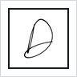
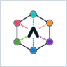
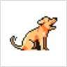
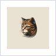

# Token Glace integration catalog

Token Glace is a fork of [vincentkoc/tokenjuice](https://github.com/vincentkoc/tokenjuice). The `token-glace` and `tokenjuice` launchers shipped by this fork run the same CLI. Claude Code uses [PostToolUse result replacement by default](claude-code-integration.md).

The [harness and framework catalog](#harness-and-framework-catalog) below lists every client in one table, with setup commands, configuration locations, and integration modes.
It includes CLI and editor harnesses, desktop clients, guidance formats, external plugins, and framework adapters.

Each table entry links to its setup guide. For more detail, use:

- [Documentation index](README.md) — all integration guides and reference pages.
- [Framework integrations](framework-integrations.md) — Hermes, Copilot SDK, LangChain, Mastra, and FastMCP setup.
- [Adapter support and verification](adapter-support-matrix.md) — native test versions and remaining acceptance work.
- [Complete verification inventory](verification-inventory.md) — every installer target and alias, with its evidence level.

Guidance files ask an agent to call `tokenjuice wrap`; they do not compact every command automatically.
Manual imports need host-side setup. Retired additive hooks remain explicit-wrapping routes, and a passing doctor check does not prove that a host loaded an integration.

## Harness and framework catalog

| Logo | Harness / client / framework | Integration | Setup | Configuration / limits |
| --- | --- | --- | --- | --- |
|  | [AdaL CLI](adal-integration.md) | Guidance | `tokenjuice install adal` | `AGENTS.md` |
|  | [Aether](aether-integration.md) | Guidance | `tokenjuice install aether` | `.aether/tokenjuice.md` / `.aether/settings.json` |
|  | [Agent Layer](agent-layer-integration.md) | Guidance | `tokenjuice install agent-layer` | `.agent-layer/instructions/tokenjuice.md`; run `al sync` after install or uninstall |
| — | [AgentInit](agentinit-integration.md) | Guidance | `tokenjuice install agentinit` | `AGENTS.md`; run `agentinit sync` after install or uninstall |
|  | [Agentlink](agentlink-integration.md) | Guidance | `tokenjuice install agentlink` | `AGENTS.md`; run `agentlink sync` after install or uninstall |
|  | [Agentloom](agentloom-integration.md) | Guidance | `tokenjuice install agentloom` | `.agents/rules/tokenjuice-agentloom.md`; run `agentloom sync` after install or uninstall |
|  | [agents-cli](agents-cli-integration.md) | Guidance | `tokenjuice install agents-cli` | `~/.agents/memory/AGENTS.md`; run `agents sync` after install or uninstall |
|  | [agents.ge](agentsge-integration.md) | Guidance | `tokenjuice install agentsge` | `.agents/rules/tokenjuice-agentsge.md` |
|  | [AGENTS.md](agents-md-integration.md) | Guidance | `tokenjuice install agents-md` | `AGENTS.md` |
|  | [AgentsMesh](agentsmesh-integration.md) | Guidance | `tokenjuice install agentsmesh` | `.agentsmesh/rules/tokenjuice.md`; run `agentsmesh generate` after install or uninstall |
| — | [AI Memory Protocol](ai-memory-protocol-integration.md) | Guidance | `tokenjuice install ai-memory-protocol` | `.memories/memory/preferences.rst` |
|  | [aictl](aictl-integration.md) | Guidance | `tokenjuice install aictl` | `AICTL.md` |
|  | [Aider](aider-integration.md) | Guidance | `tokenjuice install aider` | `CONVENTIONS.tokenjuice.md` |
|  | [Amazon Q Developer CLI / Kiro compatibility](amazon-q-integration.md) | Guidance | `tokenjuice install amazon-q` | `.amazonq/rules/tokenjuice.md` |
|  | [Amp](amp-integration.md) | Guidance | `tokenjuice install amp` | `AGENTS.md` / `AGENT.md` / `CLAUDE.md` |
|  | [Antigma Ante](ante-integration.md) | Guidance | `tokenjuice install ante` | project `AGENTS.md` or `CLAUDE.md` |
|  | [anywhere-agents](anywhere-agents-integration.md) | Guidance | `tokenjuice install anywhere-agents` | `AGENTS.local.md`; run `anywhere-agents` after install or uninstall |
|  | [Augment](augment-integration.md) | Guidance | `tokenjuice install augment` | `.augment/rules/tokenjuice.md` |
|  | [AutoClaw](autoclaw-integration.md) | Manual skill setup | Create a custom skill using the [workflow](../packaging/skills/autoclaw/tokenjuice-instructions.md) | Select the skill in a fresh conversation; execution unqualified |
|  | [Avante.nvim](avante-integration.md) | Guidance | `tokenjuice install avante` | `avante.md` |
|  | [Baz](baz-integration.md) | Guidance | `tokenjuice install baz` | `.baz/skills/tokenjuice/SKILL.md` |
|  | [Bito](bito-integration.md) | Guidance | `tokenjuice install bito` | `.bito.yaml` / `.bito/tokenjuice.md` |
|  | [Blackbox CLI](blackbox-integration.md) | Guidance | `tokenjuice install blackbox` | `.blackbox/skills/tokenjuice/SKILL.md` |
|  | [Blocks](blocks-integration.md) | Guidance | `tokenjuice install blocks` | `.agents/skills/tokenjuice-blocks/SKILL.md` |
|  | [Builder](builder-integration.md) | Guidance | `tokenjuice install builder` | `.builder/rules/tokenjuice.mdc` |
|  | [Charlie](charlie-integration.md) | Guidance | `tokenjuice install charlie` | `AGENTS.md` |
|  | [Claude Code](claude-code-integration.md) | Result replacement by default, opt-in pre-tool wrapping | `tokenjuice install claude-code` | `$CLAUDE_CONFIG_DIR/settings.json` or `~/.claude/settings.json` |
|  | [Clawdbot](clawdbot-integration.md) | Guidance | `tokenjuice install clawdbot` | `skills/tokenjuice/SKILL.md` |
|  | [Cline](cline-integration.md) | Pre-tool wrapping | `tokenjuice install cline` | `~/.cline/hooks/PreToolUse`; native CLI 3.0.74 input wrapping |
|  | [CodeAnt](codeant-integration.md) | Guidance | `tokenjuice install codeant` | `.codeant/instructions.json` |
|  | [CodeBuddy](codebuddy-integration.md) | Pre-tool wrapping | `tokenjuice install codebuddy` | `~/.codebuddy/settings.json` |
|  | [Codebuff](codebuff-integration.md) | Guidance | `tokenjuice install codebuff` | `AGENTS.md` |
|  | [Codegen](codegen-integration.md) | Guidance | `tokenjuice install codegen` | `AGENTS.md` |
|  | [Coder Agents](coder-agents-integration.md) | Guidance | `tokenjuice install coder-agents` | `.agents/skills/tokenjuice/SKILL.md` |
|  | [CodeRabbit](coderabbit-integration.md) | Guidance | `tokenjuice install coderabbit` | `.coderabbit.yaml` |
|  | [Codex CLI](codex-integration.md) | Explicit wrapping | `tokenjuice wrap -- <command>` | Native 0.166.0 hooks lack exit status; automatic compaction stays off |
|  | [Command Code](command-code-integration.md) | Explicit wrapping | `tokenjuice wrap -- <command>` | Additive hook retired; scoped legacy cleanup remains available |
| — | [Community Grok CLI](grok-cli-integration.md) | Explicit wrapping | `tokenjuice wrap -- <command>` | [Automatic hook retired](grok-cli-integration.md) |
|  | [Continue](continue-integration.md) | Guidance | `tokenjuice install continue` | `.continue/rules/tokenjuice.md` |
|  | [Crush](crush-integration.md) | Guidance | `tokenjuice install crush` | `.crush/skills/tokenjuice/SKILL.md` |
|  | [Cursor](cursor-integration.md) | Pre-tool wrapping | `tokenjuice install cursor` | `~/.cursor/hooks.json` |
|  | [Deep Agents Code](deepagents-integration.md) | Guidance | `tokenjuice install deepagents` | `.deepagents/AGENTS.md` |
|  | [DeepSeek Harness](deepseek-harness-integration.md) | Native plugin | `dsh plugin --profile PROFILE add <bundle>` | Use the packaged `dist/hosts/deepseek-harness/bundle`; PTC requires explicit wrapping |
|  | [Devin for Terminal](devin-integration.md) | Pre-tool wrapping | `tokenjuice install devin` | `.devin/hooks.v1.json` |
|  | [Docker Agent](docker-agent-integration.md) | Guidance | `tokenjuice install docker-agent` | `.docker-agent/tokenjuice.md` |
|  | [dot-agents](dot-agents-integration.md) | Guidance | `tokenjuice install dot-agents` | `~/.agents/rules/global/rules.mdc`; run `dot-agents sync` after install or uninstall |
|  | [Doubao Work](doubao-work-integration.md) | Manual skill import | Import the packaged [Doubao Work skill](../packaging/skills/doubao-work/tokenjuice/SKILL.md) | Personal file/folder import; native execution unqualified |
|  | [Droid (Factory CLI)](droid-integration.md) | Pre-tool wrapping | `tokenjuice install droid` | `~/.factory/hooks.json` or legacy settings |
|  | [ECA](eca-integration.md) | Guidance | `tokenjuice install eca` | `.eca/skills/tokenjuice/SKILL.md` |
|  | [Elyra](elyra-integration.md) | Guidance | `tokenjuice install elyra` | `.elyra/skills/tokenjuice/SKILL.md` |
|  | [FastMCP](framework-integrations.md#fastmcp) | Python middleware | `pip install 'tokenjuice-integrations[fastmcp]'` | Add `TokenjuiceMiddleware` to the server or proxy; routed MCP traffic only |
|  | [Firebase Studio](firebase-studio-integration.md) | Guidance | `tokenjuice install firebase-studio` | `.idx/airules.md` |
|  | [ForgeCode](forgecode-integration.md) | Guidance | `tokenjuice install forgecode` | `AGENTS.md` |
|  | [Gemini CLI](gemini-cli-integration.md) | Pre-tool wrapping | `tokenjuice install gemini-cli` | `~/.gemini/settings.json`; `BeforeTool` command wrapping |
|  | [GitHub Copilot CLI](copilot-cli-integration.md) | Result replacement | `tokenjuice install copilot-cli` | native Bash replacement; [1.0.105 acceptance](copilot-cli-integration.md) |
|  | [GitHub Copilot coding agent](copilot-agent-integration.md) | Result replacement | `tokenjuice install copilot-agent` | `.github/hooks/tokenjuice-agent.json` |
|  | [GitHub Copilot SDK](framework-integrations.md#github-copilot-sdk) | SDK result hook | `createCopilotSdkHooks()` from `token-glace/copilot-sdk` | Compose with application `onPostToolUse` hooks; successful Bash results only |
|  | [GitLab Duo Agent Platform](gitlab-duo-integration.md) | Guidance | `tokenjuice install gitlab-duo` | `.gitlab/duo/chat-rules.md` |
|  | [Google Antigravity](antigravity-integration.md) | Guidance | `tokenjuice install antigravity` | `.agents/rules/tokenjuice.md` |
|  | [Goose](goose-integration.md) | Guidance | `tokenjuice install goose` | `.goosehints` |
|  | [gptme](gptme-integration.md) | Guidance | `tokenjuice install gptme` | `AGENTS.md` |
|  | [Greptile](greptile-integration.md) | Guidance | `tokenjuice install greptile` | `.greptile/rules.md` |
|  | [Grok Bot](grok-bot-integration.md) | Experimental guidance | `tokenjuice install grok-bot` | experimental local rule; [cloud skill workflow](grok-bot-integration.md) |
|  | [Grok Build](grok-build-integration.md) | Guidance | `tokenjuice install grok-build` | `AGENTS.md` |
|  | [Hermes](framework-integrations.md#hermes) | Native plugin | Copy the packaged bundle, then `hermes plugins enable tokenjuice` | Native user-plugin directory; `transform_terminal_output` |
|  | [IBM Bob Shell](bob-integration.md) | Guidance | `tokenjuice install bob` | `AGENTS.md` |
|  | [Jean2](jean2-integration.md) | Guidance | `tokenjuice install jean2` | `AGENTS.md` |
|  | [JetBrains AI Assistant](jetbrains-ai-integration.md) | Guidance | `tokenjuice install jetbrains-ai` | `.aiassistant/rules/tokenjuice.md` |
|  | [Jules](jules-integration.md) | Guidance | `tokenjuice install jules` | `AGENTS.md` |
|  | [Junie](junie-integration.md) | Guidance | `tokenjuice install junie` | `.junie/AGENTS.md` |
|  | [Kilo Code](kilo-integration.md) | Guidance | `tokenjuice install kilo` | `kilo.jsonc` or `.kilo/kilo.jsonc` + `.kilo/rules/tokenjuice.md` |
|  | [Kimi Code CLI](kimi-integration.md) | Explicit wrapping | `tokenjuice wrap -- <command>` | [Automatic hook retired](kimi-integration.md) |
|  | [Kiro](kiro-integration.md) | Guidance | `tokenjuice install kiro` | `.kiro/steering/tokenjuice.md` |
|  | [Knowns](knowns-integration.md) | Guidance | `tokenjuice install knowns` | `KNOWNS.md` |
|  | [LangChain](framework-integrations.md#langchain) | Python middleware | `pip install 'tokenjuice-integrations[langchain]'` | Add `TokenjuiceMiddleware` with an explicit shell-result decoder |
| — | [LeanCTL](leanctl-integration.md) | Guidance | `tokenjuice install leanctl` | `.leanctl/instructions.md` |
|  | [LocalCode](localcode-integration.md) | On-demand tool (beta) | `tokenjuice install localcode` | `~/.localcode/plugins/tokenjuice/` |
|  | [Mastra](framework-integrations.md#mastra) | Output processor | `createMastraProcessor()` from `token-glace/mastra` | Add to `outputProcessors` with application decoder/replacement callbacks |
|  | [mcp-agent](mcp-agent-integration.md) | Guidance | `tokenjuice install mcp-agent` | `.mcp-agent/agents/tokenjuice.md` |
|  | [mini-SWE-agent](mini-swe-agent-integration.md) | Guidance | `tokenjuice install mini-swe-agent` | `.mini-swe-agent/tokenjuice.yaml` |
|  | [Mistral Vibe](mistral-vibe-integration.md) | Guidance | `tokenjuice install mistral-vibe` | `AGENTS.md` |
|  | [Mux / Xum](mux-integration.md) | Explicit wrapping | `tokenjuice wrap -- <command>` | [Automatic hook retired](mux-integration.md) |
| — | [NovaKit CLI](novakit-integration.md) | Guidance | `tokenjuice install novakit` | `NOVAKIT.md` |
|  | [Ona Agent](ona-integration.md) | Guidance | `tokenjuice install ona` | `.ona/skills/tokenjuice/SKILL.md` |
|  | [Open Interpreter](open-interpreter-integration.md) | Guidance | `tokenjuice install open-interpreter` | `AGENTS.md` |
|  | [Open WebUI](openwebui-integration.md) | Manual tool import (beta) | `tokenjuice install openwebui` | `.openwebui/tools/tokenjuice_compact.py`; then import in Workspace Tools |
|  | [OpenClaw](https://docs.openclaw.ai/tools/tokenjuice) | External plugin | `openclaw plugins install @openclaw/tokenjuice` | `~/.openclaw/openclaw.json`; enable plugin and restart Gateway (see below) |
|  | [OpenCode V1](spec.md#install-doctor-and-uninstall) | Result replacement | `tokenjuice install opencode` | `~/.config/opencode/plugins/tokenjuice.js` |
|  | [OpenCode V2](opencode-v2-integration.md) | Result replacement | `tokenjuice install opencode-v2` | foreground `shell` result replacement; native v2.0.18 acceptance |
|  | [OpenHands](openhands-integration.md) | Explicit wrapping | `tokenjuice wrap -- <command>` | Manual wrapping; [legacy hook cleanup](openhands-integration.md) |
|  | [pi](spec.md#install-doctor-and-uninstall) | Result replacement | `tokenjuice install pi` | `~/.pi/agent/extensions/tokenjuice.js` |
| — | [pi-go](pi-go-integration.md) | Guidance | `tokenjuice install pi-go` | `.pi/skills/tokenjuice/SKILL.md` |
|  | [Plandex](plandex-integration.md) | Guidance | `tokenjuice install plandex` | `PLANDEX.tokenjuice.md` |
|  | [QClaw](qclaw-migration.md) | Migration only | Follow the WorkBuddy migration guide | No QClaw hook installer; qualify WorkBuddy separately |
|  | [Qoder (guidance)](qoder-integration.md) | Guidance | `tokenjuice install qoder` | `AGENTS.md`; use `qoder-cli` for the replacement hook |
|  | [Qoder CLI](qoder-integration.md) | Result replacement | `tokenjuice install qoder-cli` | Native `PostToolUse`; separate from Qoder guidance below |
|  | [QoderWork skills](qoderwork-integration.md) | Guidance | `tokenjuice install qoderwork` | guidance skill at `~/.qoderwork/skills/tokenjuice/SKILL.md` |
|  | [Qodo Code Review](qodo-integration.md) | Guidance | `tokenjuice install qodo` | `.pr_agent.toml` |
|  | [Qwen Code](qwen-code-integration.md) | Pre-tool wrapping | `tokenjuice install qwen-code` | `.qwen/settings.json` |
|  | [QwenWork](qwenwork-integration.md) | Guidance | `tokenjuice install qwenwork` | guidance skill at `~/.qwenwork/skills/tokenjuice/SKILL.md` |
|  | [Replit Agent](replit-integration.md) | Guidance | `tokenjuice install replit` | `replit.md` |
|  | [Roo Code](roo-integration.md) | Guidance | `tokenjuice install roo` | `.roo/rules/tokenjuice.md` |
|  | [Rovo Dev CLI](rovo-integration.md) | Guidance | `tokenjuice install rovo` | `AGENTS.md` |
| — | [Ruler](ruler-integration.md) | Guidance | `tokenjuice install ruler` | `.ruler/tokenjuice.md` |
|  | [Stagewise](stagewise-integration.md) | Guidance | `tokenjuice install stagewise` | `.stagewise/skills/tokenjuice/SKILL.md` |
|  | [SWE-agent](swe-agent-integration.md) | Guidance | `tokenjuice install swe-agent` | `.swe-agent/tokenjuice.yaml` |
|  | [T3 Code](t3-code-integration.md) | Provider integration | Configure the selected Codex, Claude Code or OpenCode provider | Install on the machine executing tools; no separate T3 installer |
|  | [Tabby](tabby-integration.md) | Guidance | `tokenjuice install tabby` | `~/.tabby/config.toml` |
|  | [Tabnine CLI](tabnine-integration.md) | Guidance | `tokenjuice install tabnine` | `TABNINE.md` |
|  | [Trae](trae-integration.md) | Guidance | `tokenjuice install trae` | `.trae/rules/project_rules.md` |
|  | [UiPath for Coding Agents](uipath-integration.md) | Guidance | `tokenjuice install uipath` | `AGENTS.md` |
|  | [VS Code Copilot Chat (Local)](vscode-copilot-integration.md) | Pre-tool wrapping | `tokenjuice install vscode-copilot` | `~/.copilot/hooks/tokenjuice-vscode.json` |
|  | [Warp](warp-integration.md) | Guidance | `tokenjuice install warp` | `AGENTS.md` / `WARP.md` |
|  | [Windsurf](windsurf-integration.md) | Guidance | `tokenjuice install windsurf` | `.windsurf/rules/tokenjuice.md` |
|  | [WorkBuddy](workbuddy-integration.md) | Manual skill import | Import the packaged [WorkBuddy skill](../packaging/skills/workbuddy/tokenjuice/SKILL.md) | Desktop import and execution unqualified; separate from CodeBuddy CLI |
|  | [Zed](zed-integration.md) | Guidance | `tokenjuice install zed` | `.rules` |
|  | [Zencoder](zencoder-integration.md) | Guidance | `tokenjuice install zencoder` | `.zencoder/rules/tokenjuice.md` |

Logos use locally stored, padded tiles for light and dark themes. A dash means no verified project mark is available; see [logo sources and standards](logos/README.md).

## Installation notes

Claude Code installs a PostToolUse hook that replaces eligible Bash output:

```bash
tokenjuice install claude-code
tokenjuice doctor claude-code
```

Restart the host or start a fresh session as its guide requires.
A successful doctor check confirms managed configuration. It does not prove that the host loaded it or delivered compacted output.
Use `tokenjuice uninstall claude-code` to remove tokenjuice's managed wiring.

OpenClaw uses the external `@openclaw/tokenjuice` plugin:

```bash
openclaw plugins install @openclaw/tokenjuice
openclaw config set plugins.entries.tokenjuice.enabled true
openclaw gateway restart
```

Match the plugin to your OpenClaw version. See the [OpenClaw guide](https://docs.openclaw.ai/tools/tokenjuice) for host compatibility.

The OpenClaw adapter compacts shell results, not Code Mode JavaScript results.
Code Mode inputs carrying `code` pass through unchanged, even when OpenClaw
also supplies that JavaScript in a `command` alias. Genuine shell `command`
inputs still use the normal compaction and inspection-output protections.
